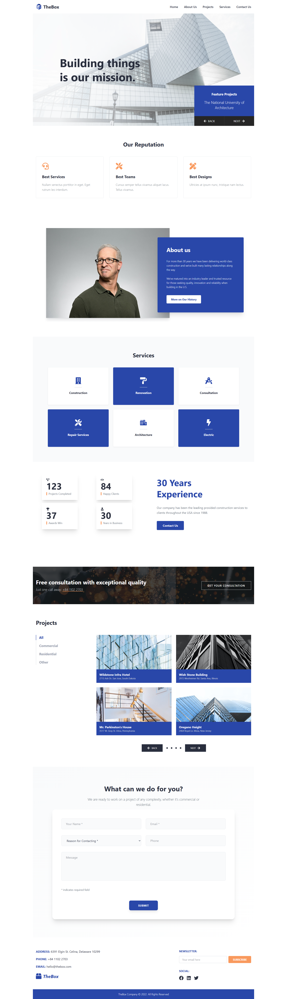

# The Box - Construction Company Website



A modern, responsive website for **The Box**, a leading construction company with over 30 years of experience delivering world-class construction services in the U.S. Built with cutting-edge web technologies to showcase our commitment to quality, innovation, and reliability.

## 🌟 Features

- **Responsive Design**: Optimized for all devices - desktop, tablet, and mobile
- **Modern UI/UX**: Clean, professional design with smooth animations
- **Company Showcase**: Highlighting our history, services, projects, and reputation
- **Interactive Elements**: Contact forms, project galleries, and service inquiries
- **Performance Optimized**: Built with Next.js for fast loading and SEO benefits

## 🛠️ Tech Stack


## 🚀 Getting Started

### Prerequisites

- Node.js (version 18 or higher)
- npm, yarn, pnpm, or bun

### Installation

1. Clone the repository:

```bash
git clone <repository-url>
cd the-box
```

2. Install dependencies:

```bash
npm install
# or
yarn install
# or
pnpm install
# or
bun install
```

3. Run the development server:

```bash
npm run dev
# or
yarn dev
# or
pnpm dev
# or
bun dev
```

4. Open [http://localhost:3000](http://localhost:3000) in your browser to view the website.

## 📁 Project Structure

```
the-box/
├── app/
│   ├── components/
│   │   ├── AboutUs.jsx
│   │   ├── Consultation.jsx
│   │   ├── ContactForm.jsx
│   │   ├── Footer.jsx
│   │   ├── Hero.jsx
│   │   ├── Navbar.jsx
│   │   ├── Projects.jsx
│   │   ├── Reputation.jsx
│   │   ├── Services.jsx
│   │   └── Stats.jsx
│   ├── favicon.ico
│   ├── globals.css
│   ├── layout.jsx
│   └── page.jsx
├── public/
│   ├── Images/
│   ├── Project_Images/
│   ├── Services_icons/
│   ├── Social_icons/
│   └── logo.svg
├── package.json
├── next.config.mjs
├── tailwind.config.mjs
└── README.md
```

## 🎨 Components Overview

- **Navbar**: Navigation menu with smooth scrolling
- **Hero**: Main banner with company mission and featured projects
- **Reputation**: Showcase of company achievements and trust indicators
- **AboutUs**: Company history and background
- **Services**: List of construction services offered
- **Stats**: Key performance metrics and statistics
- **Consultation**: Call-to-action for project consultations
- **Projects**: Gallery of completed projects
- **ContactForm**: Contact form for inquiries
- **Footer**: Site footer with links and social media

## 📜 Available Scripts

- `npm run dev` - Start development server
- `npm run build` - Build for production
- `npm run start` - Start production server
- `npm run lint` - Run ESLint for code quality

## 🚀 Deployment

The easiest way to deploy this Next.js app is to use the [Vercel Platform](https://vercel.com/new) from the creators of Next.js.

For detailed deployment instructions, check out the [Next.js deployment documentation](https://nextjs.org/docs/app/building-your-application/deploying).

## 🤝 Contributing

Contributions are welcome! Please feel free to submit a Pull Request.

## 📄 License

This project is private and proprietary to The Box Construction Company.

## 📞 Contact

For inquiries about our construction services, please visit our website or contact us through the contact form.
